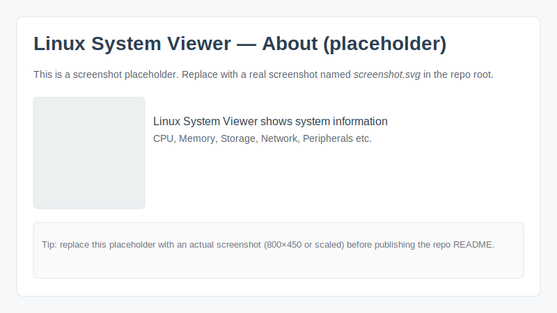

# Linux System Viewer



Official project home & binaries: https://lsv.nalle.no/

Linux System Viewer (LSV) is a small, focused Qt6-based GUI tool that presents
detailed system hardware and software information on Linux. It provides both a
user-friendly overview and technical ("geek") views of components such as CPU,
memory, storage, network, and more.

Key features
- Clean, read-only design: the app gathers information using system utilities and
	presents it without modifying the system.
- Two presentation modes: user-friendly summaries and detailed technical views.
- Portable packaging via AppImage for easy distribution.
- Developer-friendly build options and an opt-in debug logger for safe
	troubleshooting (disabled by default in release builds).

Screenshots and binary downloads
- Live demo, releases and packaging builds are published at: https://lsv.nalle.no/

Quickstart — build & run (developer)

1. Build a debug/dev binary with the optional debug logger compiled in:

```bash
cmake -S . -B build_debug -DLSV_ENABLE_DEBUG_LOGGER=ON
cmake --build build_debug -j
LSV_DEBUG=1 ./build_debug/LSV
```

When run with `LSV_DEBUG=1` the debug build writes non-invasive logs to
`$(QDir::tempPath())/lsv-debug.log` (commonly `/tmp/lsv-debug.log`).

2. Build a release binary (no logging compiled in — recommended for releases):

```bash
cmake -S . -B build_release -DLSV_ENABLE_DEBUG_LOGGER=OFF
cmake --build build_release -j
./build_release/LSV
```

3. Build the AppImage (default packaging uses a release build with no logger):

```bash
./makeit.sh
```

If you need a developer AppImage that includes the logger, build with
`-DLSV_ENABLE_DEBUG_LOGGER=ON` before running `./makeit.sh`, or add the
`--debug-logger` option to the packaging script (not enabled by default).

One-liner examples
- Default (build, package and RUN the AppImage):

```bash
./makeit.sh
```

- Build/package without running the AppImage (opt-out):

```bash
./makeit.sh --norun
```

- Create a developer AppImage that includes the debug logger and run it (logger still needs LSV_DEBUG=1 at runtime):

```bash
./makeit.sh --debug-logger --run
LSV_DEBUG=1 ./LSV/lsv-x86_64.AppImage
```

Logging policy and design
- Default (release): NO logging and no files written by the app.
- Developer/debug builds: logging is compiled in only when the CMake option
	`LSV_ENABLE_DEBUG_LOGGER` is enabled. Runtime logging still requires the
	environment variable `LSV_DEBUG=1` (or `true`) to actually write logs.
- Logs are deliberately written to the system temp dir to avoid persistent
	files in user folders or inside AppImages.

Why this model
- Respect for users' machines: the application is intended to be read-only for
	normal users and will not leave traces or write files unless explicitly
	requested by developers for debugging.

Contributing
- Bug reports, feature requests and patches are welcome. If you plan to add
	functionality that writes persistent data, please discuss it first.

License
- This project is distributed under the GNU General Public License v2 (GPLv2).

Contact / Project home
- Homepage and downloadable binaries: https://lsv.nalle.no/

Enjoy — and thanks for keeping users' machines respected and secure.


This document explains how logging works, how to enable it for development, and how to produce release builds / AppImages without logging.

